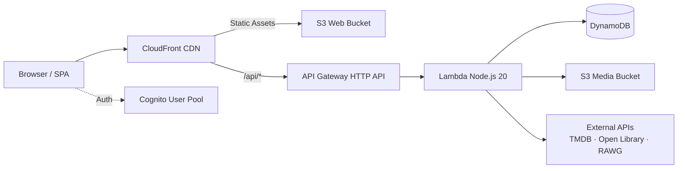
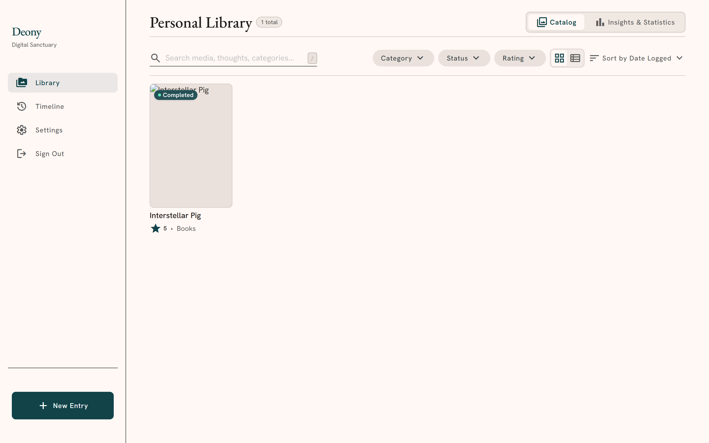
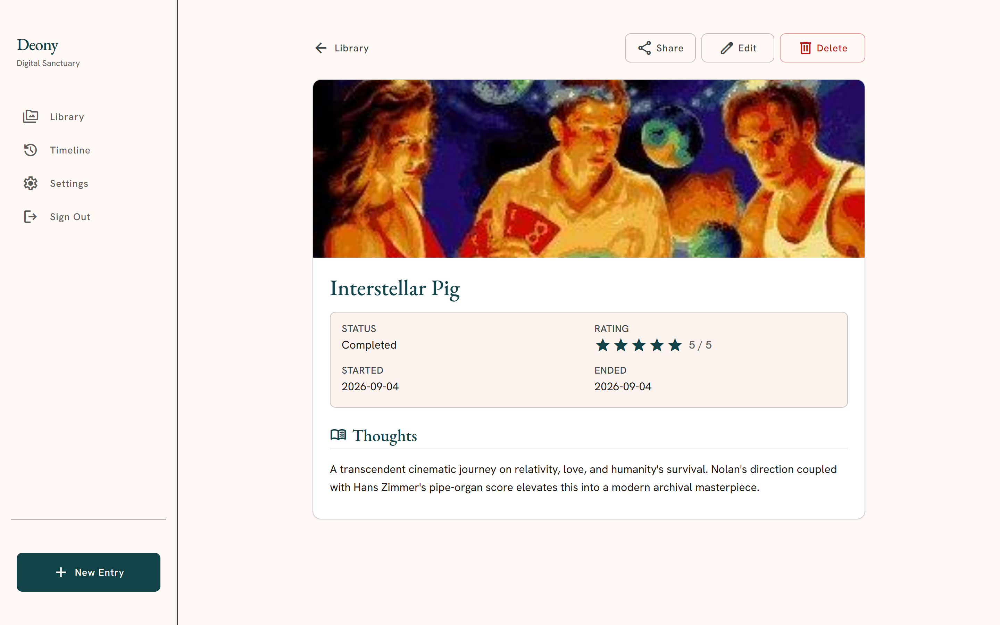
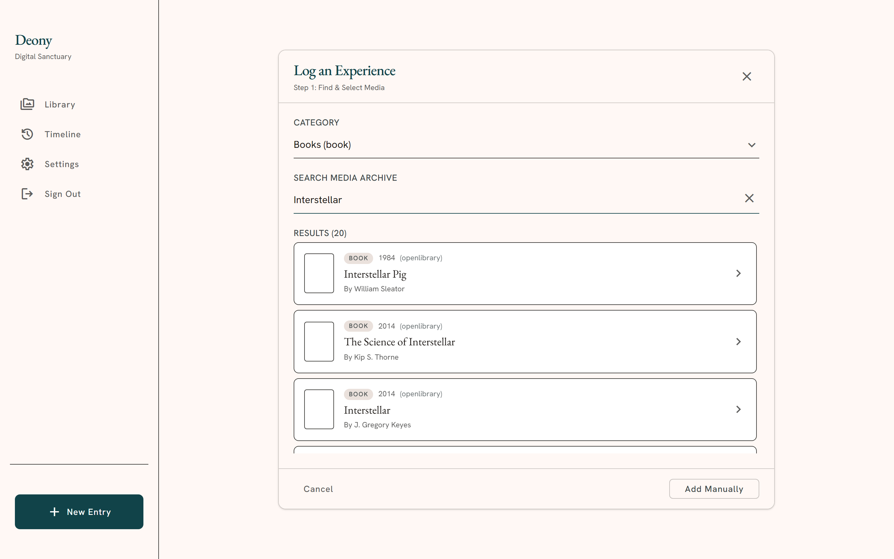
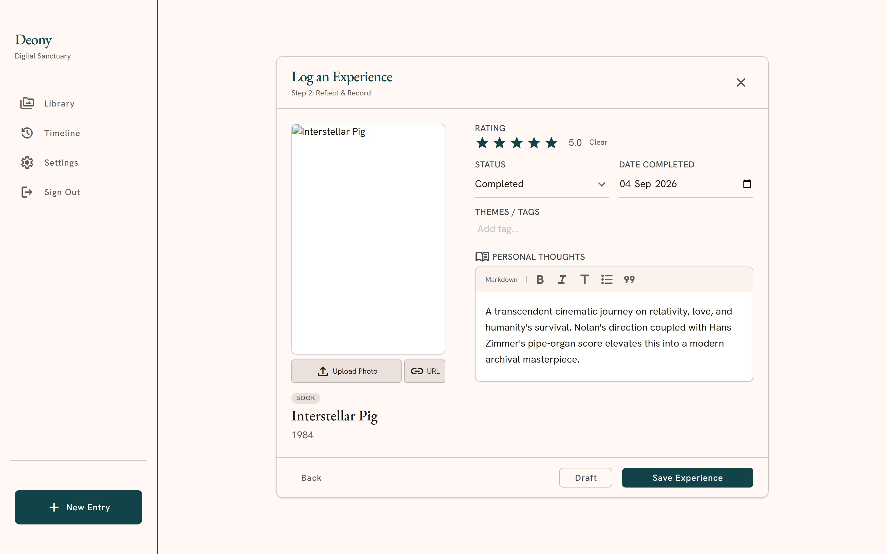
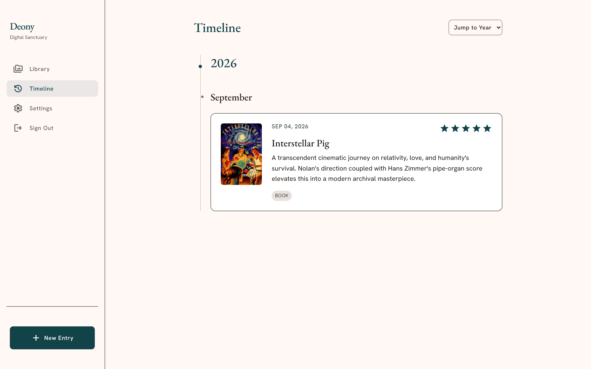
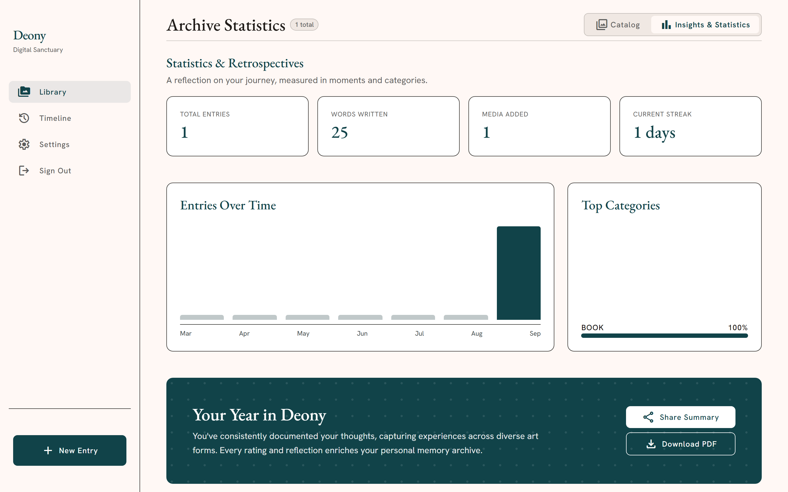

# Deony

A personal media experience archive for movies, TV, books, and games. Unlike standard trackers that only record consumption counts, Deony logs the experience—ratings, dates, and markdown journal entries tied to each title.

[Live Demo](https://d1cdomhzh1pe4j.cloudfront.net) · [Architecture](#architecture) · [Screenshots](#screenshots) · [Data Model](#data-model) · [Getting Started](#getting-started)

---

## Architecture

Serverless AWS stack deployed via AWS CDK.



- **Frontend**: React 18, TypeScript, Vite, Tailwind CSS, Tiptap.
- **Backend**: Express on AWS Lambda, API Gateway v2, Amazon Cognito.
- **Storage**: DynamoDB (on-demand), S3 for custom cover uploads.
- **Routing**: CloudFront with edge function for client-side SPA rewrites.

---

## Screenshots

### Library & Experience Journal

| Personal Library | Experience Detail |
|---|---|
|  |  |

### Logging & Search

| Provider Search (TMDB / RAWG / Open Library) | Log Experience Modal |
|---|---|
|  |  |

### Timeline & Analytics

| Chronological Timeline | Archive Statistics & PDF Export |
|---|---|
|  |  |

---

## Data Model

Four DynamoDB tables configured with on-demand capacity:

- `deony-users`: User profiles, public vanity URLs, streaks, and word counts.
- `deony-categories`: User taxonomies bound to immutable media types (`movie`, `tv`, `book`, `game`).
- `deony-media`: Canonical media pool deduplicated by deterministic key `PROVIDER#{source}#{id}` or `MANUAL#{user_id}#{uuid}`.
- `deony-experiences`: Core user archival records.

### Secondary Indexes (`deony-experiences`)

| Index | PK | SK | Purpose |
|---|---|---|---|
| **Primary** | `USER#{user_id}` | `EXP#{id}` | Item lookup / mutations |
| **GSI1** | `USER#{user_id}#CAT#{category_id}` | `STATUS#{status}#DATE#{sort_date}` | Category + status queries |
| **GSI2** | `USER#{user_id}` | `DATE#{sort_date}` | Sparse timeline (wishlist omitted) |
| **GSI3** | `USER#{user_id}` | `TITLE#{media_title}` | Alphabetical listing |
| **GSI4** | `USER#{user_id}` | `CREATED#{created_at}` | Recency-sorted views |

---

## Getting Started

### Local Development

Runs offline using DynamoDB Local, mock S3, and local auth:

```bash
# Install dependencies
npm install

# Initialize local DynamoDB tables
npm run dev:setup

# Start dev server (Vite + Express API + DynamoDB Local)
npm run dev
```

- Web: `http://localhost:5173`
- API: `http://localhost:3001`
- DynamoDB Local: `http://localhost:8000`

### Testing

```bash
# Unit & invariant tests (Vitest)
npm test

# End-to-end browser tests (Playwright)
npx playwright test
```

### AWS Deployment

Infrastructure is defined in `cdk/`. See [`docs/deployment-guide.md`](docs/deployment-guide.md) for details.

```bash
# Build frontend and Lambda bundle
npm run build
npm run build:server

# Deploy via CDK
npx cdk deploy
```

---

## License

MIT
