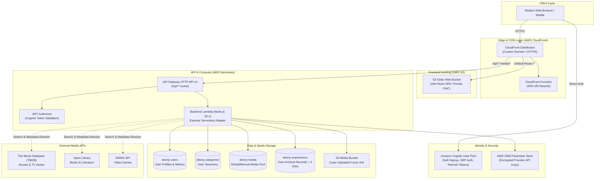
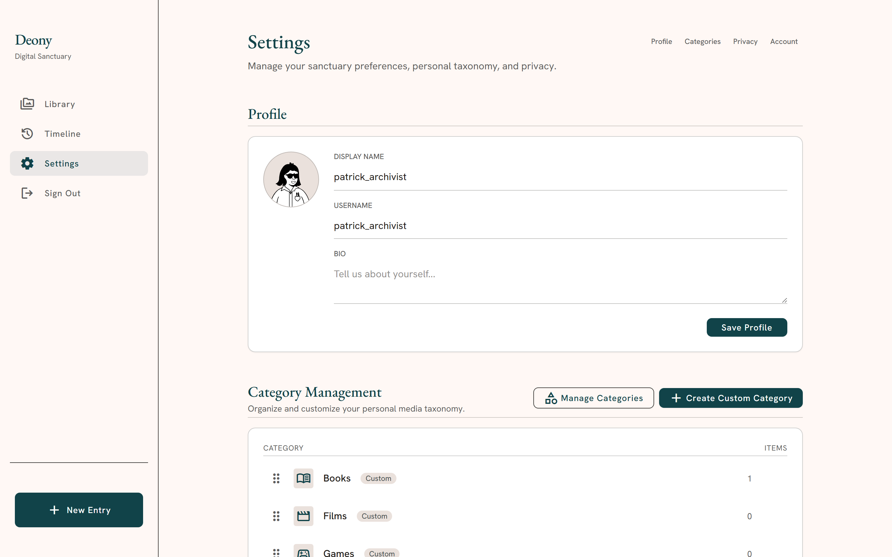

# Deony

<p align="center">
  <strong>A personal media-experience archive — curating memories, thoughts, and reflections across cinema, literature, and gaming.</strong>
</p>

<p align="center">
  
  
  
  
  
  
  
  
  
</p>

---

## ✦ The Philosophy

Most media trackers are glorified spreadsheets or checklists focused on consumption metrics: *"I watched 50 movies this year."*

**Deony is an experience archive.** It is built around a simple insight: what matters is not the media itself, but your personal encounter with it — when you experienced it, the circumstances of your life at the time, your candid thoughts, memorable quotes, and how it resonated.

* **Media vs. Experience separation**: Media represents the canonical creative work (title, creator, release date, poster). An Experience represents your specific personal journey with that work (status, rating, start/finish dates, reflection journal).
* **Zero algorithmic noise**: No public feeds, social clout metrics, or recommendation algorithms. Your archive is private by default, with optional unguessable public profile sharing.
* **Warm, editorial design**: Typography-first interface with warm amber accents, subtle card surfaces, and rich Markdown journaling powered by Tiptap.

---

## ✦ System Architecture

Deony is deployed as a 100% serverless, zero-maintenance AWS application built with the AWS Cloud Development Kit (CDK).



---

## ✦ Visual Tour

### 1. The Personal Library
The primary home of your archive. Features instant client-side tokenized search, status filters (`In Progress`, `Completed`, `Wishlist`, `Dropped`), dynamic 5-star ratings, and a seamless toggle between Poster Grid and Editorial List views.


### 2. Archival Experience Detail
Every logged experience receives a dedicated reader view. Formatted with editorial typography, progress metrics, status badges, and a custom Markdown viewer displaying personal journal reflections.


### 3. Universal Provider Search & Auto-Resolution
Search effortlessly across cinema, television, literature, and gaming in real-time. Selecting an item automatically deduplicates and provisions the canonical media record.


### 4. Logging an Experience & WYSIWYG Journal
Step-by-step entry flow: rate on a clean 5-star scale, set precise completion dates, upload custom cover art or link external images, and write thoughts in a rich Tiptap editor with instant formatting shortcuts.


### 5. Retrospective Insights & PDF Export
Inspect your archival habits: monthly experience distributions, total word counts, category breakdowns, and active logging streaks. Includes one-click **Download PDF** for a publication-ready annual summary.


### 6. Chronological Retrospective Timeline
Browse your journey across time. Items are ordered strictly by computed experience date, keeping wishlist items off the timeline while grouping finished works into a visual retrospective.


### 7. Settings & Custom Taxonomy
Organize your collection your way. Create custom categories bound to specific media types (`movie`, `tv`, `book`, `game`), reorder them with drag-and-drop, and toggle public profile sharing.



---

## ✦ Architectural Invariants

The data model and access patterns follow strict, load-bearing guarantees:

| Invariant | Guarantee | Rationale |
|---|---|---|
| **Deterministic Media Identity** | `PROVIDER#{source}#{external_id}` or `MANUAL#{user_id}#{uuid}` | Uniqueness enforced via conditional `PutItem` on Primary Key. Prevents duplicate provider entries globally without expensive GSI scans. |
| **Two Ownership Modes** | Provider media is global (`user_id = null`); manual media is user-scoped. | Eliminates cross-user namespace collisions while reusing canonical public metadata. |
| **Computed `sort_date`** | `sort_date` is computed automatically and absent for `Want to Experience`. | Sparse `GSI2 TimelineIndex` excludes wishlist items without complex query filters. |
| **Strict Rating Semantics** | `rating: null` strictly distinct from `rating: 0`. | Unrated works are never falsified as zero-star entries in analytics or star indicators. |
| **Optimistic Concurrency** | Conditional write checking `version` attribute on experience updates. | Eliminates accidental overwrites when editing entries across multiple devices. |
| **Stateless Edge Rewrite** | CloudFront Function rewrites SPA sub-paths (`/library`, `/timeline`) to `/index.html` at the edge. | Sub-millisecond latency for client-side routing without turning API 404s into HTML. |

### DynamoDB Index Schema (`deony-experiences`)

| Index Name | Partition Key (`PK`) | Sort Key (`SK`) | Access Purpose |
|---|---|---|---|
| **Primary Key** | `USER#{user_id}` | `EXP#{experience_id}` | Direct item fetch, update, delete |
| **GSI1 CategoryStatusIndex** | `USER#{user_id}#CAT#{category_id}` | `STATUS#{status}#DATE#{sort_date}` | Category filtering & status partitioning |
| **GSI2 TimelineIndex** | `USER#{user_id}` | `DATE#{sort_date}` | Chronological timeline & date ranges (sparse) |
| **GSI3 AlphaIndex** | `USER#{user_id}` | `TITLE#{media_title}` | Alphabetical sorting |
| **GSI4 RecentlyAddedIndex** | `USER#{user_id}` | `CREATED#{created_at}` | Recency-sorted archive views |

---

## ✦ Tech Stack

| Layer | Technology | Purpose |
|---|---|---|
| **Frontend UI** | React 18, TypeScript, Vite | Core Single Page Application |
| **Styling & Icons** | Tailwind CSS, Google Material Symbols | Warm editorial aesthetic & design system |
| **Rich Text Editor** | Tiptap (ProseMirror) + Markdown Plugin | WYSIWYG thought logging & markdown serialization |
| **Export & Analytics** | jsPDF, Canvas API, Chart rendering | Publication-ready archive summary export |
| **Cloud Hosting** | AWS CloudFront + Amazon S3 | Edge CDN with Origin Access Control (OAC) |
| **API & Compute** | Amazon API Gateway HTTP API + AWS Lambda | Serverless Express backend (Node.js 20.x) |
| **Database** | Amazon DynamoDB (On-Demand) | Sub-10ms key-value & indexed document storage |
| **Authentication** | Amazon Cognito User Pools | Secure SRP authentication, JWT validation |
| **Infrastructure** | AWS CDK v2 (TypeScript) | 100% reproducible Infrastructure as Code |
| **Media Metadata** | TMDB API, Open Library API, RAWG API | Rich multi-medium metadata & high-res posters |
| **Testing** | Vitest, Playwright | Invariant unit test suite & full E2E browser tests |

---

## ✦ Getting Started

### Prerequisites
* **Node.js**: v20.x or higher
* **Java 11+** *(only for running local DynamoDB in offline mode)*
* **AWS CLI & CDK** *(only for cloud deployment)*

### 1. Local Offline Development
Deony includes a complete offline developer environment (local DynamoDB, local S3, mock auth) that requires zero cloud accounts:

```bash
# Clone the repository
git clone https://github.com/your-username/deony.git
cd deony

# Install dependencies
npm install

# Run one-time local database setup
npm run dev:setup

# Launch the unified development environment (Frontend + API + Local DynamoDB)
npm run dev
```

* **Frontend**: `http://localhost:5173`
* **Local Backend API**: `http://localhost:3001`
* **Local DynamoDB**: `http://localhost:8000`

### 2. Running Automated Tests

```bash
# Run Vitest unit & invariant tests
npm test

# Run Playwright E2E integration test suite
npx playwright test
```

### 3. Deploying to AWS

For production deployment to your AWS account, see the comprehensive runbook in [`docs/deployment-guide.md`](docs/deployment-guide.md):

```bash
# 1. Build frontend and backend bundles
npm run build
npm run build:server

# 2. Deploy AWS infrastructure via CDK
npx cdk bootstrap aws://ACCOUNT-ID/REGION
npx cdk deploy
```

---

## ✦ Project Structure

```
deony/
├── bin/                    # AWS CDK application entrypoint
├── cdk/                    # AWS CDK Stack (CloudFront, API Gateway, DynamoDB, Cognito, S3)
├── docs/                   # Product vision, design specifications, and screenshots
│   ├── deony-product-vision.md
│   ├── deployment-guide.md
│   ├── design.md
│   └── screenshots/        # High-DPI application captures
├── server/                 # Express backend & AWS Lambda handler
│   ├── handlers/           # Route handlers (auth, categories, media, experiences)
│   ├── middleware/         # Cognito JWT authentication & rate limiting
│   ├── providers/          # TMDB, Open Library, and RAWG integrations
│   └── lambda.ts           # Serverless Express Lambda adapter
├── src/                    # Frontend React SPA
│   ├── components/         # Reusable UI components (modals, cards, editor, layout)
│   ├── contexts/           # Auth and Global State providers
│   ├── pages/              # Primary route pages (Library, Timeline, Settings, Auth)
│   └── services/           # Frontend API & Cognito client services
└── tests/                  # Playwright E2E and Vitest unit test suites
```

---

## ✦ License

Distributed under the MIT License. Built with care for archivists, cinephiles, avid readers, and gamers.
